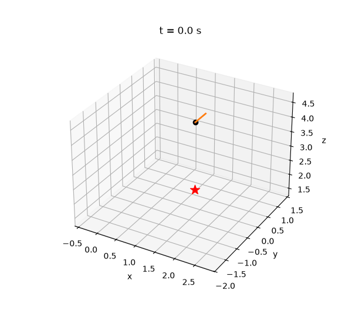
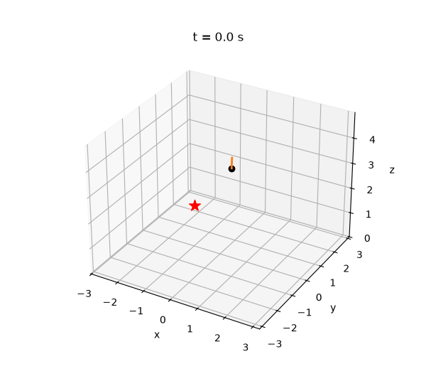

# drone_sim — RL quadrotor simulator for Apple silicon

A self-contained physics simulator + PPO trainer for autonomous quadrotors,
built to run fast on a MacBook (M-series). No MuJoCo, no Isaac Gym — just
PyTorch. Simulates ~150,000 physics steps/second on an M3 CPU with 1024
drones in parallel, enough to train a hover policy from scratch in a few
minutes.



*Recovery task: the drone is **thrown in fully inverted, spinning at 17 rad/s**,
and rights itself into a stable hover in ~0.6 s. Across 512 violently-thrown
drones at max difficulty, **100% recover (median 0.68 s)**, trained entirely on
a MacBook. This is the aggressive, nonlinear flight regime where naive
controllers fail.*


*Hover task: a policy trained from scratch in ~2 minutes flies to the red target
and holds within 2 cm, correcting against randomized mass, thrust, and drag.*



*The waypoint policy chases a stream of targets, hitting 30+ in 30 seconds.*

## Quick start

```bash
uv venv --python 3.12 .venv
uv pip install --python .venv/bin/python torch numpy matplotlib

# Train a hover policy (~2-3 min, ~20M sim steps)
.venv/bin/python train.py --task hover

# Watch it fly LIVE in a window (real-time 3D, flies autonomously)
.venv/bin/python watch.py --task hover

# Or render to files: runs/hover/trajectory.png and runs/hover/flight.gif
.venv/bin/python evaluate.py --task hover

# Harder task: fly through a sequence of random waypoints
.venv/bin/python train.py --task waypoint --updates 600
.venv/bin/python watch.py --task waypoint          # steer it yourself, live

# Hardest task: recover from being thrown in tumbling and inverted
.venv/bin/python train.py --task recovery --updates 500   # uses a curriculum
.venv/bin/python evaluate.py --task recovery --seed 16     # render the recovery
```

## Flying it yourself — manual waypoints

`watch.py` opens a live 3D window and, for the waypoint task, lets you drop new
waypoints by hand while the drone is airborne. Focus the window and press:

| Key | Action |
|-----|--------|
| `w` / `s` | waypoint forward / back (+y / −y) |
| `a` / `d` | waypoint left / right (−x / +x) |
| `r` / `f` | waypoint up / down |
| `space` | drop a random waypoint |
| `c` | clear the queue and hover in place |

Each key drops a waypoint 1.5 m from the drone's current position; it flies your
queued points in order, then holds at the last one. The first keypress switches
the env out of random-target mode into your manual queue.

**From your own code**, it's a one-liner — the same API the viewer uses:

```python
from drone_sim.env import QuadrotorEnv
env = QuadrotorEnv(num_envs=1, task="waypoint")
env.reset()
env.queue_waypoint([2.0, 1.0, 1.5])   # fly here first
env.queue_waypoint([-2.0, 0.0, 2.0])  # then here
# ... step the env; the drone visits them in order.
```

The queue lives in `QuadrotorEnv` (`drone_sim/env.py`): `queue_waypoint()` and
the `manual_queue` / `manual_mode` fields. That's the place to script flight
paths, patrol loops, or read waypoints from a file.

## What's in the box

```
drone_sim/
  physics.py   Batched rigid-body quadrotor dynamics (pure PyTorch)
  env.py       Vectorized RL environment: hover, waypoint, recovery tasks
  ppo.py       PPO with GAE, tuned for the batched env
  viz.py       Training curves, 3D trajectory plots, flight GIFs
train.py       Training CLI
watch.py       Live real-time 3D viewer (opens a window, flies forever)
evaluate.py    Roll out a trained policy, render plots + GIF
```

## Physics model

- X-configuration quadrotor: 0.75 kg, 25 cm motor-to-motor, thrust-to-weight 2.75
- Rigid-body dynamics with quaternion attitude and Euler's rotation equation
  (diagonal inertia), semi-implicit Euler integration at 250 Hz with 5
  substeps per 50 Hz control step
- First-order motor lag (τ = 33 ms) — the policy has to plan around actuator
  delay, like a real drone
- Rotor yaw drag torque, linear body drag, angular damping
- **Domain randomization** per episode: mass ±20%, thrust gain ±10%,
  drag ±30% — the standard sim-to-real trick so policies don't overfit to
  one airframe

All state is `[num_envs, ...]` tensors, so thousands of drones step in one
vectorized call.

## RL setup

- **Observation (22-d):** vector to target, velocity, body→world rotation
  matrix, angular velocity, previous action
- **Action (4-d):** normalized per-rotor thrust commands in [-1, 1]
- **Reward:** shaped. Hover uses exponential proximity + an upright/alive
  bonus and speed/spin/jerk penalties. Waypoint uses *progress* toward the
  target plus a capture bonus and a soft speed cap — deliberately **not**
  proximity, which the policy learns to exploit by parking just outside the
  capture radius and farming the reward (see the code comments in `env.py`).
  Recovery uses a *priority ladder*: righting the attitude dominates, then
  arresting the spin, then holding the hover point — the weights encode that
  order, plus a bonus for reaching the stabilized state.
- **Curriculum:** the recovery task ramps difficulty (throw violence) from
  0.15 → 1.0 over the first 60% of training, so the policy masters mild tumbles
  before facing fully-inverted 12-rad/s throws. `env.set_difficulty(0..1)`.
- **Algorithm:** PPO, 1024 parallel envs × 64-step rollouts (65k samples per
  update), GAE(λ=0.95), clip 0.2, correct time-limit bootstrapping

## Results

| Task | Metric | Result |
|------|--------|--------|
| Hover | final distance to target | **~2 cm** |
| Waypoint | checkpoints hit in 30 s | **30+** (see limitations) |
| Recovery | recover from a max-difficulty throw | **100%** of 512 drones, **median 0.68 s** |

All trained from scratch on a MacBook M3 CPU in 2–5 minutes each.

## Known limitations

- The **waypoint** policy reliably hits dozens of targets but still
  destabilizes and crashes on some episodes under aggressive domain
  randomization (~2 of 5 random seeds fly a full 30 s clean). Tightening this
  is a reward/curriculum tuning problem — a good first thing to improve.
- The **recovery** policy touches the ground on ~2% of throws — these are cases
  thrown *downward* near the floor with too little altitude to physically
  right in time, not control failures.
- Physics is a rigid-body point model: no aerodynamic ground effect, blade
  flapping, or battery sag. Good enough to learn control; not a wind-tunnel.
- No sensor noise or actuation latency **yet** — so policies are not sim-to-real
  ready. That's the next milestone (see `ROADMAP.md`).

## Device notes (M-series Macs)

`--device auto` picks **CPU**, on purpose. MPS (the Metal GPU backend) works
(`--device mps`) but is ~5× slower for this workload: the physics loop is
many small kernel launches and GPU dispatch overhead dominates. CPU on an M3
does ~150k steps/s. MPS would win with much larger networks or 10k+ envs.

## Extending it

- **New tasks:** subclass or edit `env.py` — velocity tracking, trajectory
  following, gates/racing are all a `_sample_targets` + `_reward` change.
- **Sensors:** the obs is assembled in `QuadrotorEnv._obs`; add noise or an
  IMU-only variant there for realism.
- **Sim-to-real:** widen the randomization ranges in `QuadrotorParams`, add
  observation noise and action latency, then export the actor MLP (2×128
  tanh — tiny) to run onboard.
